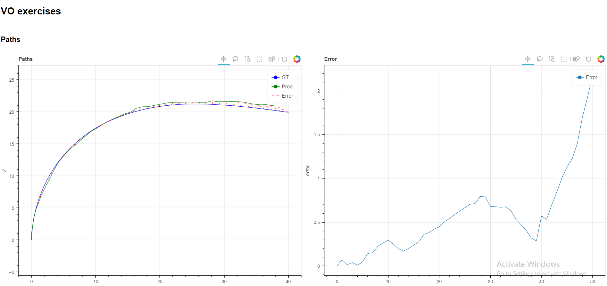

# Visual Odometry

This project implements Visual Odometry using ORB features and the KITTI dataset.

## Project Structure
```
.
├── KITTI_sequence_1
├── KITTI_sequence_2
├── lib
│ ├── visualization
│ │ ├── init.py
│ │ ├── plotting.py
│ │ ├── video.py
├── KITTI_sequence_2.html
├── main.py
├── plot.png
```


## Overview

Visual Odometry is the process of determining the position and orientation of a robot by analyzing the images captured by its camera(s). This project uses ORB (Oriented FAST and Rotated BRIEF) to detect and compute keypoints and descriptors, and the FLANN (Fast Library for Approximate Nearest Neighbors) based matcher to find matches between them.

## Setup and Installation

1. **Clone the repository:**

    ```bash
    git clone https://github.com/yourusername/visual_odometry.git
    cd visual_odometry
    ```

2. **Install the required dependencies:**

    ```bash
    pip install -r requirements.txt
    ```

3. **Run the main script:**

    ```bash
    python main.py
    ```

## Usage

- The project loads calibration data, ground truth poses, and image sequences from the specified directory.
- It detects and matches ORB features between consecutive frames and computes the camera motion.
- The estimated trajectory is compared against the ground truth.

## Results

Below is a sample plot showing the ground truth and estimated trajectories for the KITTI Sequence 2 dataset.



## Files

- **main.py**: The main script to run the visual odometry pipeline.
- **KITTI_sequence_1**, **KITTI_sequence_2**: Directories containing image sequences and corresponding calibration and pose files.
- **lib/visualization**: Contains helper functions for visualization and video playback.
- **KITTI_sequence_2.html**: A visualization of the estimated trajectory compared to the ground truth.
- **plot.png**: The resulting plot showing the estimated and ground truth trajectories.

## Acknowledgments

- The KITTI dataset: http://www.cvlibs.net/datasets/kitti/
- OpenCV library: https://opencv.org/

## License

This project is licensed under the MIT License. 
